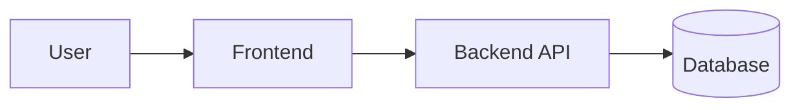

# Architecture

Updated: <YYYY-MM-DD> · Decisions: see `decisions/`

## Overview
<one paragraph: what the system does and its main parts>

## Stack
| Layer | Technology | Version | Notes |
|---|---|---|---|
| Frontend | | | |
| Backend | | | |
| Database | | | |
| Hosting / CI | | | |

## Structure
- `<path>`: <what lives there>

## Conventions
- <naming, layering, error handling, API style…>

## Constraints and risks
- <performance, security, compliance, known debt>
